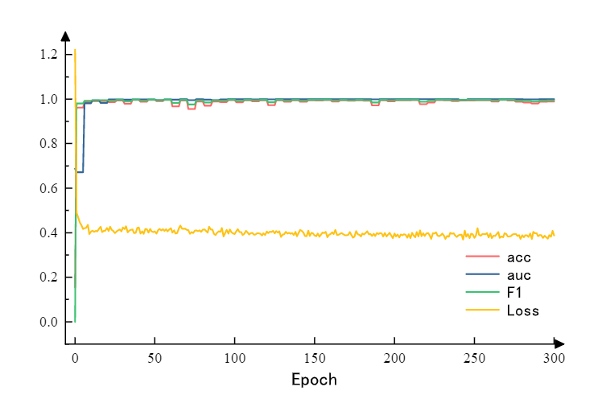

# RND(Unsupervised Outlier Detection with Reinforced Noise Discriminat)

## Notes
We are planning a major update to the code in the near future, so if you have any suggestions, please feel free to email [ME](ldh1594683@163.com) or mention them in the issue.

## Requirements
* pytorch1.7
* python>=3.6

## Prepare Your Dataset
Here are some manual and real datasets 

### Example1
if your source dataset is :
```
source_dataset
dataset
├── data_1.csv
├── data_2.csv
├── data_3.csv
└── ...
```


## Training
```
python RND.py
```

## By The Way
This project is not perfect and there are still many problems. If you are using this project and would like to give the author some feedbacks, you can send [ME](ldh1594683@163.com) an email.

## Related works
If this code is helpful for you, you can cite these for us. Thank you.
```

## Result



[1] Liu Y , Li Z , Zhou C , et al. "Generative Adversarial Active Learning for Unsupervised Outlier Detection", arXiv:1809.10816, 2018.
[2] Zhao, Y., Nasrullah, Z. and Li, Z., 2019. PyOD: A Python Toolbox for Scalable Outlier Detection. Journal of machine learning research (JMLR), 20(96), pp.1-7.
```
